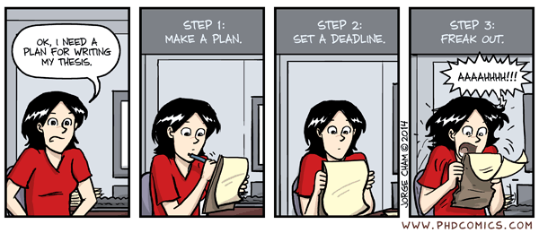

# XVIII ENCUENTRO ANUAL DE LA <span style='color: #e67e22;'>SCHPP</span>

## Revisión de <span style='color: #e67e22;'>bases</span> y búsqueda de info

\
Antes de postular, revisa activamente el sitio oficial: [XVIII Encuentro de la Sociedad de Políticas Públicas](https://www.sociedadpoliticaspublicas.cl/encuentros/18-encuentro-2026/){target="_blank"}

- Lee las **bases del concurso académico** ([link al formulario de inscripción](https://www.sociedadpoliticaspublicas.cl/inscripcion-xviii-encuentro/){target="_blank"}).

- Identifica las **fechas críticas** y los **requisitos formales**.

- Revisa el **perfil de la conferencista magistral** (Laura Alfaro, BID/Harvard) para alinear tu propuesta con la línea temática del encuentro.

- Analiza si tu investigación encaja en las **áreas temáticas** habilitadas.

- Verifica los **criterios de evaluación** para calibrar el esfuerzo en cada sección del resumen.

**💡 Tip: Guarda el cronograma. Una postulación exitosa no es solo buena investigación, es también buena gestión del tiempo.**

## Proceso y fechas <span style='color: #e67e22;'>clave</span>

| Aspecto | Información |
|------------------------------|------------------------------------------|
| **Convocatoria** | Investigaciones académicas y trabajos aplicados a políticas públicas, con sustento académico. |
| **Postulación** | Hasta el **30 de agosto de 2026, 23:59 horas**. |
| **Áreas temáticas** | Hasta **2 áreas**: educación, salud, pobreza/desigualdad, trabajo, migraciones, seguridad, medio ambiente, modernización del Estado, tecnología e IA, entre otras. |
| **Resumen** | Antecedentes, objetivos, metodología, resultados esperados y **3 a 5 palabras clave**. |
| **Preselección** | Resultados a más tardar el **10 de septiembre de 2026**. |
| **Trabajo completo** | Hasta el **18 de octubre de 2026**. Máx. **10.000 palabras**, español o inglés, formato **PDF**. |
| **Selección definitiva** | **12 de noviembre de 2026**. |
| **Presentación** | Envío hasta el **10 de diciembre de 2026**. Hasta **10 minutos** por autor. |
| **Encuentro** | **17 de diciembre de 2026** — Universidad San Sebastián. |

## Criterios de evaluación inicial

\

| Criterio                                | Ponderación |
|-----------------------------------------|-------------|
| Impacto potencial en políticas públicas | **40%**     |
| Consistencia y coherencia               | **20%**     |
| Claridad del resumen                    | **20%**     |
| Originalidad y aporte al conocimiento   | **20%**     |

\
🎯 **Estrategia:** El 40% depende de la relevancia para políticas públicas. Diseña tu pregunta pensando en quién podría usar tus hallazgos.

## 😱 PÁNICO



No tenemos nada... [**Y eso está bien. Es el punto de partida de toda investigación.**]{.underline}

## ¿Cómo nos organizamos?

Elige una estrategia:

1.  **Todos juntos** — Un solo equipo, una sola pregunta, un solo abstract.

2.  **Dos grupos disparejos** — Dos preguntas distintas, dos abstracts independientes.

3.  **Dos grupos de 2 y uno que se sacrifique y esté en los dos** — Mayor cobertura temática, pero mayor carga individual.

4.  **Individual** — Cada uno por su cuenta, máxima autonomía, máxima responsabilidad.

⏱️ **Tiempo real:** Hasta el 30 de agosto. Elegir mal ahora cuesta caro después.

# La <span style='color: #e67e22;'>Pregunta de Investigación</span>

## La Pregunta de Investigación (Origen práctico)

| Enfoque | Descripción | ¿Cuándo usarlo? |
|------------------|------------------------|------------------------------|
| **Top-down** | Parte de un **gap teórico** o vacío en la literatura. Identificas lo que falta saber y diseñas la pregunta para llenarlo. | Cuando dominas la literatura del tema. |
| **Bottom-up** | Parte de los **datos disponibles** o de una observación empírica. Dejas que los datos te guíen hacia la pregunta. | Cuando tienes acceso a bases de datos ricas pero no has definido el ángulo. |

::: callout-important
## En este curso usaremos el enfoque **Bottom-up**.
:::

> Empezamos con los datos (CASEN / EANNA) y de ahí construimos la pregunta. <https://observatorio.ministeriodesarrollosocial.gob.cl/encuesta-casen-2024> <https://observatorio.ministeriodesarrollosocial.gob.cl/eanna-2023>

## Tipos de Pregunta de Investigación

| Tipo de Pregunta | Objetivo | Ejemplo |
|:-------------------|:-------------------------|:-------------------------|
| **Descriptiva** | Describir características, fenómenos o estados de una población. | ¿Cuáles son las características demográficas de los docentes? |
| **Comparativa** | Identificar diferencias o similitudes entre grupos. | ¿Hay diferencias en el rendimiento académico entre sexos? |
| **Relacional** | Explorar la asociación entre variables. | ¿Qué relación existe entre la motivación y el desempeño? |
| **Explicativa** | Determinar causas o efectos de un fenómeno. | ¿Cómo afecta el programa X a la variable Y? |

::: callout-important
*Nota: En tesis doctorales, las preguntas son más de tipo **explicativo (causal)** o exploratorio profundo, debido a la necesidad de generar nuevo conocimiento y validar relaciones complejas.*
:::

## Características de una Buena Pregunta (1)

1.  **Claridad** — Debe ser comprensible en una sola lectura.
2.  **Especificidad** — Ni demasiado amplia ni demasiado estrecha.
3.  **Relacionalidad** — Vincula explícitamente **dos elementos** (variables): *¿Cómo afecta X a Y?*
4.  **Empiricidad** — Debe ser respondible con datos observables.

## Características de una Buena Pregunta (2)

5.  **Relevancia** — Debe importar para políticas públicas (recuerda: 40% de la evaluación).
6.  **Originalidad** — No puede ser una pregunta ya respondida mil veces.
7.  **Viabilidad** — Debes poder responderla con los datos y el tiempo disponibles.

🎯 **Fórmula útil:** ¿Cuál es el efecto de **\[variable independiente\]** sobre **\[variable dependiente\]** en **\[contexto/población\]**?

## El Framework FINER: ¿Tu pregunta de investigación es sólida?

| Letra | Criterio | Pregunta guía |
|---------|----------------------|--------------------------------|
| **F** | **Feasible** (Factible) | ¿Tienes los sujetos, la expertise técnica, el tiempo y los recursos para completarlo? |
| **I** | **Interesting** (Interesante) | ¿Capturará la curiosidad del investigador, la comunidad científica y el público general? |
| **N** | **Novel** (Novedoso) | ¿Aporta hallazgos nuevos, confirma/refuta resultados previos o ofrece una perspectiva fresca? |
| **E** | **Ethical** (Ético) | ¿Cumple con las normas éticas, seguridad, privacidad y consentimiento informado? |
| **R** | **Relevant** (Relevante) | ¿Tendrá un impacto tangible en la sociedad, la práctica clínica, las políticas públicas o la investigación futura? |

✅ Aplica FINER a tu pregunta antes de escribir una sola línea del abstract.

# De la Pregunta al <span style='color: #e67e22;'>Objetivo</span>

## Cómo transformar una pregunta en un propósito investigativo

La pregunta de investigación es **interrogativa**; el objetivo es **declarativo**.

| Pregunta de investigación | Objetivo general |
|--------------------------------------|----------------------------------|
| ¿Cuál es el efecto del acceso a educación técnica sobre la empleabilidad de jóvenes en zonas rurales? | **Analizar** el efecto del acceso a educación técnica sobre la empleabilidad de jóvenes en zonas rurales. |
| ¿De qué manera la migración venezolana ha impactado la oferta laboral en el sector servicios de Santiago? | **Evaluar** el impacto de la migración venezolana en la oferta laboral del sector servicios en Santiago. |
| ¿Existe una relación entre la exposición a contaminación atmosférica y el rendimiento académico en escuelas públicas? | **Determinar** la relación entre la exposición a contaminación atmosférica y el rendimiento académico en escuelas públicas. |

📝 **Regla:** Cambia la interrogación por un verbo de acción investigativa (analizar, evaluar, determinar, describir, comparar, etc.).

## Objetivos de Investigación: Estructura Estándar

Los objetivos deben ser medibles, alcanzables y coherentes con la pregunta central.

| Categoría | Definición | Ejemplo |
|:--------------|:--------------------------|:--------------------------|
| **General** | Expresa la finalidad última y principal del estudio. | Analizar el efecto de X sobre Y en la población Z. |
| **Específicos** | Desglosan el proceso lógico para alcanzar el objetivo general. | Identificar, Comparar, Calcular, Evaluar. |

::: callout-important
Regla de oro: Un objetivo bien planteado es un objetivo que puede ser evaluado al final del periodo de investigación.
:::

## Objetivos de Investigación: Taxonomía de Bloom

La taxonomía permite jerarquizar los objetivos según la complejidad del proceso cognitivo requerido:

| Nivel Cognitivo | Verbos sugeridos | Objetivo |
|:-----------------|:--------------------------|:--------------------------|
| **Recordar** | Definir, listar, identificar | Recuperar conocimiento base. |
| **Comprender** | Explicar, clasificar, describir | Interpretar información. |
| **Aplicar** | Calcular, usar, implementar | Utilizar métodos en contextos. |
| **Analizar** | Comparar, diferenciar, estructurar | Descomponer partes y relaciones. |
| **Evaluar** | Juzgar, validar, argumentar | Emitir juicios de valor. |
| **Crear** | Diseñar, construir, formular | Generar nuevo conocimiento. |

::: callout-important
Nota: En investigación, los objetivos suelen transitar desde la comprensión y el análisis hacia la evaluación y creación.
:::

# Pregunta -\> Objetivo -\> <span style='color: #e67e22;'>Abstract</span>

## Estructura General de un Abstract

```         
1. CONTEXTO / ANTECEDENTES (1-2 oraciones)
   → ¿Por qué importa este tema?

2. PROBLEMA / GAP (1 oración)
   → ¿Qué no se sabe todavía?

3. PREGUNTA / OBJETIVO (1 oración)
   → ¿Qué investigas y para qué?

4. METODOLOGÍA (1-2 oraciones)
   → ¿Cómo lo hiciste o harás?

5. RESULTADOS / HALLAZGOS (1-2 oraciones)
   → ¿Qué encontraste o esperas encontrar?

6. IMPLICANCIAS / CONCLUSIÓN (1 oración)
   → ¿Qué significa esto para políticas públicas?
```

> 📏 **Límite del concurso:** Máx. 150 palabras (antecedentes), 100 (metodología), 100 (resultados), 100 (objetivos). El abstract final del trabajo completo puede ser más extenso.


## Todo Parte de la Pregunta de Investigación

Subes y bajas desde el núcleo

```         
         ┌─────────────────────────────┐
         │   ANTECEDENTES / MARCO      │  ← Bajas: ¿Por qué importa?
         │   TEÓRICO / PROBLEMA        │
         └─────────────▼───────────────┘
                       │
    ┌──────────────────▼──────────────────┐
    │                                     │
    │      PREGUNTA DE INVESTIGACIÓN      │  ← NÚCLEO
    │   (¿Qué relación hay entre X e Y?)  │
    │                                     │
    └──────────────────▼──────────────────┘
                       │
         ┌─────────────▼───────────────┐
         │      OBJETIVO GENERAL       │
         └─────────────▼───────────────┘
                       │
         ┌─────────────▼───────────────┐
         │      METODOLOGÍA            │
         │   (¿Cómo respondes?)        │
         └─────────────▼───────────────┘
                       │
         ┌─────────────▼───────────────┐
         │      RESULTADOS /           │
         │      HALLAZGOS              │
         └─────────────▼───────────────┘
                       │
         ┌─────────────▼───────────────┐
         │   IMPLICANCIAS / IMPACTO    │  ← Subes: ¿Para qué sirve?
         │     (Políticas Públicas)    │
         └─────────────┬───────────────┘

```

> 🔄 **Dinámica:** La pregunta es el eje. Desde ella "subes" hacia resultados e impacto, y "bajas" hacia los antecedentes que la justifican.


## Ejemplo

| Componente | Contenido |
|---------------|-----------------------------------|
| **Introducción** | Dato/contexto |
| **Pregunta** | ¿Cuál es el efecto de la participación en Chile Solidario sobre la desnutrición crónica infantil en hogares de extrema pobreza? |
| **Objetivo** | Evaluar el efecto de Chile Solidario sobre la desnutrición crónica infantil en hogares de extrema pobreza entre 2002 y 2006. |
| **Metodología** | Diseño cuasi-experimental con diferencias en diferencias, usando datos CASEN. |
| **Resultados** | La participación en el programa redujo significativamente la desnutrición crónica infantil en aprox. 4 puntos porcentuales. |
| **Implicancia** | Los programas de transferencias condicionadas pueden ser herramientas efectivas para mejorar indicadores de salud infantil en contextos de pobreza extrema. |

> ✅ Nota cómo todo fluye desde la pregunta: los antecedentes justifican por qué importa, y los resultados responden directamente a ella.

## ¿Con qué datos trabajamos?: Opciones de Base de Datos

\

::::: columns
::: {.column width="50%"}
### Opción A: CASEN

**Encuesta de Caracterización Socioeconómica Nacional**

- Año disponible: **2022**
- Cobertura: Nacional, regional, comunal
- Temas: ingresos, empleo, educación, salud, vivienda, redes sociales, discriminación
- **Ideal para:** desigualdad, pobreza, trabajo, educación, salud, migraciones
- Acceso: Libre en el sitio del Ministerio de Desarrollo Social
:::
::: {.column width="50%"}
### Opción B: EANNA

**Encuesta de Actividades de Niños, Niñas y Adolescentes**

- Año disponible: **2023**
- Cobertura: Nacional
- Temas: trabajo infantil, educación, uso del tiempo, salud, tecnología, violencia, participación
- **Ideal para:** infancia, adolescencia, educación, tecnología, trabajo infantil, género
- Acceso: Libre en el sitio del Ministerio del Trabajo
:::
:::::

> 🤔 **Pregunta clave:** ¿Qué base te permite vincular dos variables de tu interés con suficiente variación y casos?


# Actividad <span style='color: #e67e22;'>Final</span>

## Tu misión para la próxima sesión

::: callout-important
## Entregable:

1.  **Genera una pregunta de investigación** que relacione dos variables y que pueda responderse con CASEN o EANNA.

2.  **A partir de esa pregunta, escribe un abstract** de **no más de 450 palabras** que incluya:

    - Antecedentes / delimitaciones (máx. 150 palabras)
    - Objetivos o propósitos (máx. 100 palabras)
    - Enfoque metodológico (máx. 100 palabras)
    - Resultados esperados (máx. 100 palabras)
    - 3 a 5 palabras clave

3.  **Recuerda:** La pregunta es el núcleo. Todo debe subir y bajar desde ella.
:::

> 📅 **Deadline real:** 24 de agosto de 2026. Empecemos ahora.
